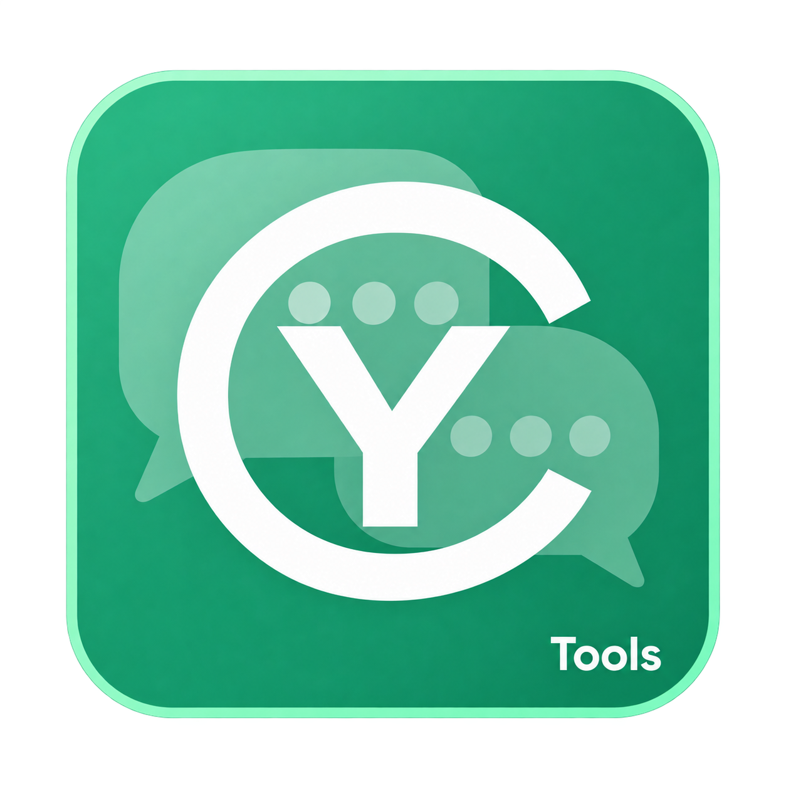

# CyTools_AIChat

<p align="center">
  
</p>

A chat engine for Windows: a desktop application, a command line and an MCP server on one
runtime, built on the [CyToolsCore](https://github.com/MrMybal/CyToolsCore) SDK. Several
conversations stay open in tabs and are kept on disk, with the models you already have access
to — the Codex, Claude Code and Antigravity command lines, any OpenAI-compatible endpoint,
Ollama — and with local GGUF models run by the Tool's own llama.cpp server, with LoRA adapters.
French user guide: [LISEZ-MOI.md](LISEZ-MOI.md). Developer guide: [app/README.md](app/README.md).

Maintenance: **Cyberalien**.

## What it does

- **Conversations in tabs**, each one a readable JSON document in `data/conversations/`.
  Closing a tab deletes nothing; deleting a conversation moves it to a backup folder. Open
  tabs are restored at the next start. Export to Markdown or JSON.
- **Two provider families, told apart in the interface and in every stored message.** A
  *session* provider (Codex, Claude Code, Antigravity, OpenCode) keeps the history on its
  side and is resumed by its native identifier; it uses the account already signed in inside
  its own program, so no key is entered here. A *stateless* provider (OpenAI-compatible
  endpoint, OpenAI, OpenRouter, Claude API, Ollama, local model) receives the stored transcript
  on every turn, so the conversation on disk is the context and a history limit really
  applies.
- **Local models with LoRA**: a pinned llama.cpp build (CPU or CUDA) downloaded and verified
  from the Models tab, GGUF weights installed from a catalogue with pinned revisions and
  SHA-256 checks, GGUF LoRA adapters with a strength that can be changed on the running
  server, a reasoning-effort setting for thinking models, and the model kept resident between
  turns. Weights already downloaded by another CyTool can be copied in with
  `app/scripts/import_models.py`.
- **Streaming, cancellation, presets**: tokens stream into the tab, a turn can be cancelled
  mid-reply and keeps what was already received, and system prompts with sampling values are
  saved as reusable presets.
- **API keys kept out of jobs and logs**: a key entered in the Providers tab is sealed with
  DPAPI for the Windows account; an environment variable you export yourself is used instead
  when present.
- **Updates in three separate streams** (application, engine, weights), staged under
  `runtime/updates`, verified before activation, with a rollback; `data/` is never replaced.
- Interface in English by default and fully in French from **Options**.

The [capability matrix](app/Docs/CapabilityCoverage.md) separates what was executed on the
author's machine from what is only wired: the Codex, Claude Code, Antigravity, Ollama and
OpenAI-compatible providers and seven local models were run; OpenCode and the paid OpenAI,
OpenRouter and Anthropic APIs were not.

## Requirements

- Windows 10/11 x64, the only platform executed by the author. A Linux launcher script is
  provided but was never run, and the engine catalogue only carries Windows builds.
- Python 3.11 and Git on the PATH to install from source (pip clones the SDK from its
  repository), and the Visual C++ Build Tools to compile the launcher.
- An NVIDIA GPU for comfortable use of local models; the CPU engine works everywhere, slowly.
  Remote providers need no GPU at all.
- Model weights and engines are **not** in this repository: they are downloaded from the
  Models tab. No release archive is published yet; install from source.

## Installation from source

```powershell
git clone https://github.com/MrMybal/CyTools_AIChat.git
cd CyTools_AIChat
py -3.11 -m venv runtime\python
.\runtime\python\Scripts\python.exe -m pip install -r app\requirements.txt
powershell -ExecutionPolicy Bypass -File app\build_launcher.ps1
```

Then double-click `CyTools_AIChat.exe`, or run `.\runtime\python\Scripts\pythonw.exe app\desktop.py`.

## First launch

1. **Providers** tab: press *Detect again*. The agent command lines that are installed and
   signed in show as available; enter a key or a base URL for the HTTP providers you want.
2. **Models** tab, for local models: install the llama.cpp engine (CUDA if you have an NVIDIA
   card, otherwise CPU), accept a model's licence on its page, download it.
3. **Chat** tab: pick a provider and a model in the tab header, write, send.

## Command line and MCP

```powershell
.\runtime\python\Scripts\python.exe app\tool.py describe
.\runtime\python\Scripts\python.exe app\tool.py invoke chat --params-file app\params.json
.\runtime\python\Scripts\python.exe app\tool.py invoke list_providers --params "{}"
.\runtime\python\Scripts\python.exe app\tool.py mcp          # MCP stdio server
```

The conversation an AI client creates over MCP is the same document the window opens: both
go through the one runtime, and the local model loaded for one is the one the other uses.

## Repository layout

```
CyTools_AIChat.exe      Windows launcher (built locally, not in git)
CyTools_AIChat.sh       Linux launcher (never executed by the author)
LISEZ-MOI.md            user guide (French)
LICENSE                 licence of the Tool's own code (GPL-3.0-only)
LICENCES/               licence texts and source links of the included components
app/                    code, manifest (CyTool.json), interface, providers, tests, scripts, docs
data/                   conversations, presets, models, jobs, logs, exports, reports (not in git)
runtime/                private Python, llama.cpp engines, downloads, staged updates (not in git)
```

Tests (fixtures only, no model loaded): `.\runtime\python\Scripts\python.exe -m pip install -r app\requirements-dev.txt`,
then `.\runtime\python\Scripts\python.exe -m pytest app\tests -q`. The acceptance scripts in
`app/tests/` run against the installed providers and weights and write their evidence to
`data/reports/`.

## Licence

The Tool's own code and interface are free software under the **GNU General Public License
v3.0 only** ([LICENSE](LICENSE)).

It is built on the CyToolsCore SDK 0.10.1, which is under the **MIT** licence. The full
text and the source links of every included component are in [LICENCES/](LICENCES): they
ship with the product, in the release archive as well as in this repository.

The llama.cpp engine, the agent command lines and every model weight are not part of the
product: they are installed or downloaded on your machine under their own licences, listed
in [app/licenses.json](app/licenses.json), in the model catalogue and in the Options tab.
The Models tab asks for your acceptance before downloading.

## Updating and going back

- **From source**: `git pull`, then
  `.\runtime\python\Scripts\python.exe -m pip install -r app\requirements.txt`. The second
  command is what moves the SDK: version 0.1.1 needs CyToolsCore 0.10.1, and replacing
  `app/` alone would leave the previous SDK in `runtime/python`.
- **From a release**: the Updates tab stages the archive, verifies it and activates it at
  your request. An archive built for another runtime is refused rather than half-applied.
  `data/` is never replaced.
- **Going back**: *Roll back* in the Updates tab restores the previous `app/` and licence
  files. From source, check out the earlier commit and run the same `pip install` again.
